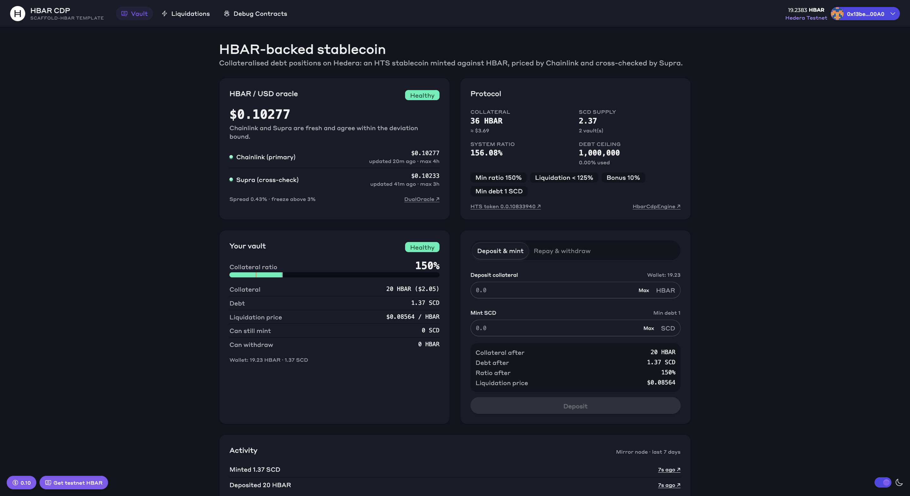

# Scaffold-HBAR — HBAR CDP Stablecoin

Lock HBAR, mint a USD stablecoin issued on the **Hedera Token Service**, repay to unlock, and let anyone liquidate unsafe vaults. Prices come from **Chainlink** (primary) and are cross-checked against **Supra**. If the two disagree, the protocol stops taking new risk on its own.


```bash
npm create scaffold-hbar@latest -- --template KodeSage/scaffold-hbar-cdp
```



The template ships wired to a **live, verified reference deployment on Hedera testnet**. `yarn next:dev` gives you a working vault UI before you deploy anything.

> **Disclaimer.** Experimental template code. Not audited. Do not put real value behind it without your own security review.

---

## Contents

- [Scaffold-HBAR — HBAR CDP Stablecoin](#scaffold-hbar--hbar-cdp-stablecoin)
  - [Contents](#contents)
  - [Why this template exists](#why-this-template-exists)
  - [Live testnet deployment \& evidence](#live-testnet-deployment--evidence)
  - [Quick start](#quick-start)
    - [Prerequisites](#prerequisites)
    - [1. Scaffold](#1-scaffold)
    - [2. Use the reference deployment (no deploy needed)](#2-use-the-reference-deployment-no-deploy-needed)
    - [3. Deploy your own](#3-deploy-your-own)
    - [Vault rules](#vault-rules)
    - [Oracle status machine](#oracle-status-machine)
    - [HTS token lifecycle](#hts-token-lifecycle)
  - [Hedera specifics you must know](#hedera-specifics-you-must-know)
  - [Commands](#commands)
  - [Configuration](#configuration)
  - [Testing](#testing)
  - [Project layout](#project-layout)
  - [Extending the template](#extending-the-template)
  - [Going to mainnet](#going-to-mainnet)
  - [Troubleshooting](#troubleshooting)
  - [Security model \& limitations](#security-model--limitations)
  - [License](#license)

---

## Why this template exists

A collateralised stablecoin is a common thing to build on a chain, and on Hedera it hides several traps:

| Problem | What this template does |
| --- | --- |
| A single price feed can go stale or wrong, and a CDP built on it can be drained | `DualOracle` validates Chainlink and Supra separately (staleness, sign, decimals, malformed data) and **freezes** when they disagree by more than 3% |
| HTS tokens are not ERC-20 contracts you deploy | The engine **creates** the token through the HTS system contract (`0x167`). It is the token's treasury and holds its only key (supply). There is no admin, freeze, wipe, KYC or pause key, so nobody can rug the token config |
| HBAR has 8 decimals in the EVM but 18 over JSON-RPC | Every value is labelled tinybar / weibar / stable units, and the TS math mirrors the Solidity math bit for bit |
| Accounts must be *associated* with a token before receiving it | The UI reads association state from the mirror node and offers a one-click HIP-719 `associate()` |
| `forge script` cannot simulate HTS calls | Deploy is split: Forge deploys the contracts, then a script creates the token over JSON-RPC, and the whole thing is still one command |

Removing either piece breaks the product. Without the oracles there is no price, so no CDP. Without HTS there is no stablecoin.

## Live testnet deployment & evidence

| What | Address / ID | Links |
| --- | --- | --- |
| `DualOracle` | `0xB99D67FCf02A8750f403c610Ac9ACF12944444bA` (`0.0.10833702`) | [HashScan](https://hashscan.io/testnet/contract/0xB99D67FCf02A8750f403c610Ac9ACF12944444bA) · Sourcify exact match |
| `HbarCdpEngine` | `0x25D723a645D0767a315Bd2DF8b798113a644f175` (`0.0.10833704`) | [HashScan](https://hashscan.io/testnet/contract/0x25D723a645D0767a315Bd2DF8b798113a644f175) · Sourcify exact match |
| Stablecoin (HTS) | `0.0.10833940` — "Scaffold CDP Dollar" (SCD), 6 decimals | [HashScan](https://hashscan.io/testnet/token/0.0.10833940) · [mirror node](https://testnet.mirrornode.hedera.com/api/v1/tokens/0.0.10833940) |

Every transaction below succeeded on testnet (`result: SUCCESS` on the mirror node):

| Step | Transaction |
| --- | --- |
| Create the HTS token from the engine (`createStablecoin`) | [HashScan](https://hashscan.io/testnet/transaction/0xe0118818c237b88e570a85d2b473535b0a2f596f07a6587b692d18e6f26c1ad4) · [mirror](https://testnet.mirrornode.hedera.com/api/v1/contracts/results/0xe0118818c237b88e570a85d2b473535b0a2f596f07a6587b692d18e6f26c1ad4) |
| Return unused creation fee (`sweepExcessHbar`) | [HashScan](https://hashscan.io/testnet/transaction/0xda872bcfc0255ae68de9f6d783d48a11e6ffb8595798ffb0ef50c43400ec412b) · [mirror](https://testnet.mirrornode.hedera.com/api/v1/contracts/results/0xda872bcfc0255ae68de9f6d783d48a11e6ffb8595798ffb0ef50c43400ec412b) |
| Open a vault: 16 HBAR in, 1 SCD minted (`depositAndMint`) | [HashScan](https://hashscan.io/testnet/transaction/0x1cd4299c499fd60d21168afe4510b1ad9096ee6ca12d2f92d6e134adadf6e5cc) · [mirror](https://testnet.mirrornode.hedera.com/api/v1/contracts/results/0x1cd4299c499fd60d21168afe4510b1ad9096ee6ca12d2f92d6e134adadf6e5cc) |
| HIP-376 allowance on the HTS token (`approve`) | [HashScan](https://hashscan.io/testnet/transaction/0x3fd3a9282675e124d87608d03abd949354ed63b02a4e1bbae9fcb4573160d144) · [mirror](https://testnet.mirrornode.hedera.com/api/v1/contracts/results/0x3fd3a9282675e124d87608d03abd949354ed63b02a4e1bbae9fcb4573160d144) |
| Close the vault: burn 1 SCD, withdraw 16 HBAR (`repayAndWithdraw`) | [HashScan](https://hashscan.io/testnet/transaction/0x4df308c859cdd3190b9c015c18c47f0374ac2fae1238290d83e21bc29daa5701) · [mirror](https://testnet.mirrornode.hedera.com/api/v1/contracts/results/0x4df308c859cdd3190b9c015c18c47f0374ac2fae1238290d83e21bc29daa5701) |
| Demo vault left open for the UI (`depositAndMint`) | [HashScan](https://hashscan.io/testnet/transaction/0x9d25558e86a4e4785f6fcddea8ada6fbe00ac616d62229674f5e74db1a9d9814) · [mirror](https://testnet.mirrornode.hedera.com/api/v1/contracts/results/0x9d25558e86a4e4785f6fcddea8ada6fbe00ac616d62229674f5e74db1a9d9814) |

Deploy transactions: [DualOracle](https://hashscan.io/testnet/transaction/0x62cd1e935b1baefac6baaa4ac4cf728aa0e44c52c8a2ee01bc89e99062fda105) · [HbarCdpEngine](https://hashscan.io/testnet/transaction/0x4eb41eefd69bdbcbb7c47876663fd954bdb2cf7772ee13193f7f1805b086ce9e).

Reproduce the evidence on your own deployment with `yarn foundry:smoke`. It prints the same HashScan and mirror-node links and writes them to `packages/foundry/deployments/296-smoke.json`.

## Quick start

### Prerequisites

- Node.js ≥ 20.18.3 and Git
- [Foundry](https://book.getfoundry.sh/getting-started/installation) (`forge`, `cast`). The CLI runs `forge install` for you
- A wallet on **Hedera Testnet** (chain id 296), e.g. MetaMask with RPC `https://testnet.hashio.io/api`. A burner wallet is built in for quick tests
- Testnet HBAR from the [Hedera Portal faucet](https://portal.hedera.com/faucet)

### 1. Scaffold

```bash
npm create scaffold-hbar@latest -- --template KodeSage/scaffold-hbar-cdp
cd <your-project>
```

The template supports **Foundry** with **Next.js**, using yarn (default) or npm.

### 2. Use the reference deployment (no deploy needed)

```bash
yarn next:dev
```

Open http://localhost:3000, connect a wallet on Hedera Testnet, fund it from the faucet, and:

1. **Deposit & mint**: enter HBAR collateral and an SCD amount. The preview shows your resulting collateral ratio and liquidation price *before* you sign, computed with the same math the contract enforces.
2. **Repay & withdraw**: approve SCD (HTS allowance, step 1), then repay and/or withdraw (step 2). With zero debt you can always withdraw everything, even if the oracle is down.
3. **Liquidations** (`/liquidations`): every open vault sorted by collateral ratio, with an inline liquidate form for unsafe ones.

### 3. Deploy your own

```bash
yarn foundry:test                 # 55 offline unit, fuzz and invariant tests; HTS emulated locally
yarn foundry:account:generate     # creates an encrypted Foundry keystore
# fund the printed address with ~30 testnet HBAR: https://portal.hedera.com/faucet
yarn foundry:deploy               # DualOracle + HbarCdpEngine -> HTS token -> frontend ABIs
yarn foundry:smoke                # open + close a vault on testnet, print evidence links
yarn foundry:status               # oracle health, risk params, totals, token id
yarn next:dev
```

`yarn foundry:deploy` targets Hedera testnet by default and asks which keystore to use. It runs three steps:

1. `forge script script/Deploy.s.sol` deploys `DualOracle` and `HbarCdpEngine` (~2.6 HBAR).
2. `scripts-js/createStablecoin.js` calls `createStablecoin` with a USD-sized HBAR payment (≈ $2), then sweeps the unused part back to you (net HTS fee ≈ $1).
3. `scripts-js/generateTsAbis.js` writes the addresses and ABIs to `packages/nextjs/contracts/deployedContracts.ts`. The UI switches to your contracts automatically.

Verify your contracts so HashScan shows the source:

```bash
cd packages/foundry
forge verify-contract <DualOracle address> contracts/oracle/DualOracle.sol:DualOracle --chain-id 296 --verifier sourcify
forge verify-contract <Engine address> contracts/HbarCdpEngine.sol:HbarCdpEngine --chain-id 296 --verifier sourcify
```


### Vault rules

| Parameter | Default | Meaning |
| --- | --- | --- |
| Minimum collateral ratio | 150% | Required after every mint or withdrawal |
| Liquidation ratio | 125% | Below this, anyone can liquidate |
| Liquidation bonus | 10% | Extra collateral paid to the liquidator |
| Minimum debt | 1 SCD | No dust positions too small to be worth liquidating |
| Debt ceiling | 1,000,000 SCD | Cap on total supply, owner-adjustable |

Collateral ratio = `collateral value in USD / debt`. A vault is liquidatable when `collateral < ceil(debt × 125% / price)`. The UI shows the exact **liquidation price**, which is the HBAR price where that flips.

**Liquidation.** A liquidator repays any part of an unsafe vault's debt (leaving 0 or at least the minimum). In return they get `repaid × 1.10 / price` in HBAR, capped at the vault's collateral. Above 110% collateralisation every liquidation strictly improves the vault's ratio, and a unit test asserts this (116.66% → 123.33%).

**Owner powers** are deliberately small: set the debt ceiling, pause *minting* (repay, withdraw and liquidate stay open), and sweep HBAR that is *not* collateral. Risk parameters and the oracle are immutable; to change them, deploy a new engine.

### Oracle status machine

`DualOracle.latestPrice()` never reverts. It returns a price plus a status, and the engine decides what each status allows:

| Status | When | Price used | Mint / withdraw with debt / liquidate | Deposit / repay / withdraw with no debt |
| --- | --- | --- | --- | --- |
| `Ok` | Both fresh, within 3% | Chainlink | ✅ | ✅ |
| `PrimaryOnly` | Supra stale/broken | Chainlink | ✅ | ✅ |
| `SecondaryOnly` | Chainlink stale/broken | Supra | ✅ | ✅ |
| `Frozen` | Both fresh, disagree > 3% | none | ❌ `OracleUnusable` | ✅ |
| `Unavailable` | Neither fresh | none | ❌ `OracleUnusable` | ✅ |

Each feed is checked for: positive answer, non-zero timestamp, max age (Chainlink 4h, Supra 3h; testnet Chainlink updates on ~0.5% moves), sane decimals, overflow-free scaling to 18 decimals, and return data of the right length. A feed address with no code cannot make the oracle revert, because reads use `staticcall`, which (unlike `try/catch`) also survives undecodable return data. Supra quotes HBAR/**USDT**; that approximation is only used for the cross-check, and the 3% band absorbs normal peg noise.

### HTS token lifecycle

1. **Create.** `createStablecoin` calls `createFungibleToken` on `0x167` with `treasury = engine`, a single **supply key** set to the engine's contract ID, `autoRenewAccount = engine`, infinite supply type (bounded by the debt ceiling instead), and `msg.value` covering the HTS fee.
2. **Mint.** `mintToken` mints into the treasury (the engine), then `transferToken(engine → user)`. If the user is not associated, HTS returns code `184` and the engine reverts with `NotAssociated(user)`.
3. **Repay / liquidate.** The user approves the engine on the token's ERC-20 facade (HIP-376). The engine pulls with `transferFrom(token, user, engine, amount)` and burns from the treasury with `burnToken`.
4. **Invariant.** SCD total supply = `totalDebt` = sum of vault debts, and the treasury never holds tokens between transactions. This is fuzzed in `HbarCdpEngine.invariant.t.sol`.

## Hedera specifics you must know

These are the things that break naive EVM ports. Every one is handled in code, and the comments say where.

1. **Two HBAR units.** Inside the EVM, `msg.value`, `address.balance` and the contract's `collateral` are **tinybars** (1 HBAR = 10⁸). JSON-RPC `value` and `eth_getBalance` use **weibars** (10¹⁸), and the relay converts. The frontend sends `tinybars × 10¹⁰` as `value` and rejects inputs with more than 8 decimals, which the relay cannot carry. See `utils/cdp/math.ts` (`tinybarsToWeibars`).
2. **Token association.** An account can receive an HTS token only if it is associated or has a free auto-association slot. Accounts created from an EVM address get unlimited slots (HIP-904, `max_automatic_token_associations = -1`). The UI checks this on the mirror node and offers HIP-719 `associate()` when needed.
3. **Accounts are created on first receipt.** A brand-new MetaMask address is not a Hedera account until it receives HBAR (HIP-583). The UI detects this through the mirror node and points to the faucet.
4. **`forge script` cannot run HTS calls.** Forge simulates in a local EVM with no `0x167`, so the HTS step runs over JSON-RPC (`createStablecoin.js`). Tests use [`hashgraph/hedera-forking`](https://github.com/hashgraph/hedera-forking) to emulate HTS offline.
5. **Gas is charged on the limit.** Hedera charges at least 80% of the gas limit, so scripts use `eth_estimateGas` + 20% rather than large fixed limits.
6. **Mirror-node topic queries need a time window.** `/contracts/{id}/results/logs?topic1=…` requires a `timestamp` range shorter than 7 days. The activity feed queries the last 7 days minus one minute.
7. **No Multicall3 in viem's Hedera chain config.** The UI issues parallel `eth_call`s in one react-query snapshot instead of relying on multicall.

## Commands

| Command | What it does |
| --- | --- |
| `yarn next:dev` | Run the vault UI on http://localhost:3000 |
| `yarn next:build` / `yarn next:serve` | Production build / serve |
| `yarn next:test` | Frontend unit tests (math, parsing, formatting) |
| `yarn foundry:test` | Unit, fuzz and invariant tests (offline) |
| `yarn foundry:test:fork` | Read the live Chainlink and Supra feeds through `DualOracle` on a testnet fork |
| `yarn foundry:account:generate` | Create an encrypted deployer keystore |
| `yarn foundry:account` | Show keystore address and balances |
| `yarn foundry:deploy` | Deploy contracts, create the HTS token, export ABIs |
| `yarn foundry:smoke` | Open and close a vault on testnet and print evidence links |
| `yarn foundry:status` | Oracle health, parameters, totals, token |
| `yarn lint` / `yarn format` | Lint / format both packages |

Scripts that sign ask for the keystore and password interactively. For non-interactive use, set `ETH_PASSWORD` to a password *file*; this is the same convention `forge` and `cast` use.

## Configuration

`packages/foundry/.env` (created from `.env.example` on install, never committed) controls deployment:

| Variable | Default | Notes |
| --- | --- | --- |
| `CHAINLINK_MAX_AGE_SECONDS` | `14400` | Max age of the Chainlink answer |
| `SUPRA_MAX_AGE_SECONDS` | `10800` | Max age of the Supra price |
| `MAX_ORACLE_DEVIATION_BPS` | `300` | Disagreement that freezes the oracle |
| `MIN_COLLATERAL_RATIO_BPS` | `15000` | Must be ≥ liquidation ratio |
| `LIQUIDATION_RATIO_BPS` | `12500` | Must be > 10000 + bonus (enforced in the constructor) |
| `LIQUIDATION_BONUS_BPS` | `1000` | ≤ 2500 |
| `MIN_DEBT` | `1000000` | 1.00 stablecoin (6 decimals) |
| `DEBT_CEILING` | `1000000000000` | 1,000,000.00 |
| `STABLECOIN_NAME` / `STABLECOIN_SYMBOL` | `Scaffold CDP Dollar` / `SCD` | Token metadata |
| `STABLECOIN_CREATE_BUDGET_USD` | `2` | HBAR sent for the HTS fee, sized from the live price |

Feed addresses live in `packages/foundry/script/Deploy.s.sol` (testnet and mainnet, from the Chainlink and Supra docs). The frontend reads `NEXT_PUBLIC_HEDERA_TESTNET_RPC_URL` and `NEXT_PUBLIC_WALLET_CONNECT_PROJECT_ID` from `packages/nextjs/.env.local` if set.

## Testing

```bash
yarn foundry:test        # offline: 55 tests incl. 512-run fuzzing and an 8,192-call invariant campaign
yarn foundry:test:fork   # live: DualOracle against the real Hedera testnet feeds
yarn next:test           # 18 frontend tests; same vectors as the Solidity tests
```

- `DualOracle.t.sol` covers every status transition, inclusive freshness bounds, deviation in both directions, reverting feeds, feeds without code, malformed return data, decimals from 0 to 36, overflow, and a fuzz test that `latestPrice()` never reverts.
- `HbarCdpEngine.t.sol` runs against the HTS emulator (real precompile ABI, no hand-written fake token). It covers exact MCR boundaries, dust and ceiling rules, pause semantics, oracle policy, missing-association and HTS error surfacing, liquidation maths, pagination, and admin access. Fuzz tests prove `maxMintable` and `maxWithdrawable` agree exactly with the enforced checks.
- `HbarCdpEngine.invariant.t.sol` checks supply = debt = Σ vault debts, collateral fully backed, no dust debt, and debt ≤ ceiling across random deposits, mints, repays, withdrawals, liquidations and price moves. Coverage was measured: ~540 successful mints and ~27 successful liquidations per campaign.
- `test/fork/DualOracleFork.t.sol` runs against the live feeds on testnet and mainnet.

## Project layout

```text
packages/
├── foundry/
│   ├── contracts/
│   │   ├── HbarCdpEngine.sol          # vaults, HTS token, liquidations
│   │   ├── oracle/DualOracle.sol      # Chainlink primary + Supra cross-check
│   │   └── interfaces/                # IHederaTokenService (subset), IAggregatorV3, ISupraSValueFeed, IPriceOracle
│   ├── script/Deploy.s.sol            # per-network feed config, env-driven risk params
│   ├── scripts-js/                    # createStablecoin, smoke, status, keystore + ABI tooling
│   └── test/                          # unit, fuzz, invariant, fork
└── nextjs/
    ├── app/page.tsx                   # vault dashboard
    ├── app/liquidations/page.tsx      # liquidation board
    ├── components/cdp/                # OracleCard, VaultSummary, VaultActions, LiquidationsTable, …
    ├── hooks/cdp/                     # useProtocol / useAccountState (reads), useCdpActions (writes)
    └── utils/cdp/                     # math (mirrors Solidity), format, mirror node client
```

## Extending the template

- **Stability fee.** Add a per-second rate and a global `debtIndex`; store normalised debt per vault. Keep the "supply = debt" invariant by minting accrued fees to a surplus address.
- **Another collateral.** Swap HBAR for an HTS token (e.g. WHBAR or a liquid staking token). Pull with HIP-376 `transferFrom`, and associate the engine with that token in `createStablecoin`.
- **DEX-backed liquidations.** Let a keeper flash-swap SCD on SaucerSwap, liquidate, and repay with seized HBAR. This needs SCD liquidity first.
- **Automated keepers.** Schedule periodic checks with the Hedera Schedule Service (HIP-1215). Chainlink and Supra are push oracles, so a scheduled call can liquidate without off-chain data.
- **Stricter oracle policy.** Reject `PrimaryOnly`/`SecondaryOnly` in `_usablePrice` if your risk appetite requires two fresh sources.

After contract changes: `yarn foundry:test`, `yarn foundry:deploy`, and the UI picks up the new ABI.

## Going to mainnet

1. Re-verify both feed addresses and the Supra pair id in `Deploy.s.sol` against the provider docs, and confirm the mainnet heartbeats before setting max ages.
2. Get an independent audit. Start with liquidation incentives, oracle bounds, and the bad-debt case below.
3. Deploy: `yarn foundry:deploy -- --network hedera_mainnet`.
4. Add `chains.hedera` to `targetNetworks` in `packages/nextjs/scaffold.config.ts`.
5. Move ownership to a multisig: `transferOwnership` + `acceptOwnership` (Ownable2Step).

## Troubleshooting

| Symptom | Cause | Fix |
| --- | --- | --- |
| `NotAssociated(account)` | Account has no association and no free auto-association slot | Click **Associate SCD** in the UI, or call `associate()` on the token |
| `OracleUnusable(3)` / `(4)` | Feeds disagree / both stale | Check `yarn foundry:status`; repay and deposit still work |
| `Undercollateralised(required)` | The action would leave the vault below 150% | Deposit more, or mint/withdraw less (the UI preview shows why) |
| `DebtBelowMinimum` | The remaining debt would be between 0 and the minimum | Repay everything or leave at least the minimum |
| `HtsCallFailed(selector, code)` | HTS returned a non-success code | Look up the code in Hedera's `ResponseCodeEnum` (e.g. 292/293 = allowance problems) |
| Repay reverts without a clear reason | No HTS allowance | Approve first (the UI does this as step 1) |
| `insufficient funds for intrinsic transaction cost` | Wallets reserve `value + gasLimit × maxFee` | Keep a few spare HBAR above the amount you send |
| Activity feed is empty right after a transaction | The mirror node lags consensus by a few seconds | Wait, it refreshes every 15s |
| `No deployment found for chain 296` | Scripts need `deployments/296.json` or `deployedContracts.ts` | Run `yarn foundry:deploy` |

## Security model & limitations

- **Not audited.**
- **Bad debt is not socialised.** If a vault falls below 100% before anyone liquidates it, the liquidator can take all the collateral, and any remaining debt stays recorded but unbacked. Production systems add a stability pool or surplus buffer.
- **No interest or stability fee**, and there are no redemptions, so the peg relies on over-collateralisation and arbitrage via repay/liquidate.
- **Trust assumptions:** Chainlink and Supra operators, the USDT≈USD approximation for the cross-check, and the owner's limited powers listed above.
- The reference testnet deployment is a demo. Its owner key belongs to the template author.

## License

MIT, see [LICENCE](LICENCE). Built on the [Scaffold-HBAR](https://github.com/hedera-dev/scaffold-hbar) stack (itself derived from Scaffold-ETH 2).
